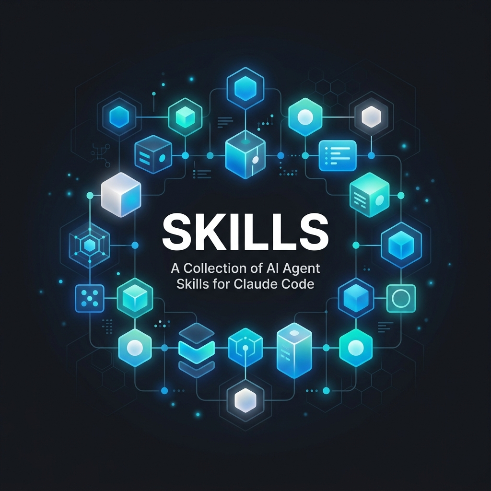

# Skills

[](https://github.com/RohiRIK/skills)
[](LICENSE)

> _Powered by caffeine and life's questionable coffee-cup choices._ ☕️

My everyday [Agent Skills](https://docs.claude.com/en/docs/agents-and-tools/agent-skills) — a personal library for Claude Code, opencode, and other AI coding tools. Each folder under [`skills/`](skills) is a self-contained skill package with its own `SKILL.md` and any supporting workflows, references, or scripts.

## Skills in this repo

| Skill | What it does |
|---|---|
| [`Agy/`](skills/Agy) | Delegate a coding, refactor, PR-review, or image task to the Antigravity CLI (`agy`) as an autonomous worker, then monitor and report. |
| [`Art/`](skills/Art) | Generate images, diagrams, and visual output. Use for any visual artifact. |
| [`BackendDesign/`](skills/BackendDesign) | Reference for API design, database schema, and server architecture. |
| [`Build/`](skills/Build) | Implement plan tasks one at a time with compile and commit gates. |
| [`CodingStandards/`](skills/CodingStandards) | Language coding standards — TS, Python, Bash, PowerShell, Swift, Rust. |
| [`CodebaseOnboarding/`](skills/CodebaseOnboarding) | Analyze an unfamiliar repo → architecture map, entry points, conventions, starter CLAUDE.md. |
| [`ContextBudget/`](skills/ContextBudget) | Audit Claude Code context-window consumption and produce prioritized token-savings recommendations. |
| [`CreateMcp/`](skills/CreateMcp) | Build a Model Context Protocol (MCP) server with the official SDK — tools, resources, prompts, transport, security. Scaffold, connect, debug. |
| [`CreateCLI/`](skills/CreateCLI) | Generate a production-ready TypeScript CLI (3-tier: manual argv / Commander / oclif), Bun-only, gated by Verify. |
| [`CreateSkill/`](skills/CreateSkill) | Build and maintain skills in canonical structure. |
| [`DataReportBuilder/`](skills/DataReportBuilder) | Turn a raw Excel/CSV dataset into a two-layer stakeholder report — plain-language Summary + untouched Raw Data. bun + ExcelJS engine. |
| [`DockerPatterns/`](skills/DockerPatterns) | Reference for Docker and Docker Compose local-dev patterns. |
| [`FrontendDesign/`](skills/FrontendDesign) | Reference for React and Next.js component design patterns. |
| [`FrontendAesthetics/`](skills/FrontendAesthetics) | Anti-slop visual direction — typography, color, hierarchy, motion — so UI looks intentional, not AI-generated. |
| [`GitWorkflow/`](skills/GitWorkflow) | Reference for git branching, commit conventions, merge vs rebase, and conflict resolution. |
| [`GitHubOps/`](skills/GitHubOps) | Manage a GitHub repo via the gh CLI — hygiene, changelog, commit/push, PRs, releases, branch cleanup. |
| [`Hygiene/`](skills/Hygiene) | Audit `~/.claude` for git, skill, code, and rules hygiene issues. |
| [`IterativeDepth/`](skills/IterativeDepth) | Run 2-8 multi-lens passes over a problem to surface hidden requirements; feeds `Spec`/`Orchestrate`. |
| [`Iterate/`](skills/Iterate) | Bounded PLAN→ACT→VERIFY→REFLECT iteration toward a goal, with a state file and hard exit conditions (`/iterate`). |
| [`OpenCode/`](skills/OpenCode) | Delegate a coding/refactor/PR-review task to the OpenCode CLI as an autonomous worker. |
| [`Orchestrate/`](skills/Orchestrate) | Decompose a spec into a dependency DAG, run units in parallel via delegation, review each in a separate context. |
| [`Pi/`](skills/Pi) | Delegate a coding/refactor/PR-review task to the Pi (pi.dev) CLI as an autonomous worker. |
| [`Prompting/`](skills/Prompting) | Vendor-agnostic prompt-engineering standard library for authoring prompts, skills, agents, rules. |
| [`Reflect/`](skills/Reflect) | Self-rate the just-finished output on five axes with evidence, then fix small gaps in place. |
| [`Research/`](skills/Research) | Research a question at three depths (quick / standard / deep) by delegating to Agy/OpenCode/Pi + web search, then synthesize cited findings. |
| [`SecurityReview/`](skills/SecurityReview) | Audit code for vulnerabilities and secrets. |
| [`SkillForge/`](skills/SkillForge) | Audit the whole skill library for agentic readiness and instrument it with telemetry in bulk. |
| [`Simplify/`](skills/Simplify) | Post-implementation dead-code cleanup (`/simplify`). |
| [`Spec/`](skills/Spec) | Explore code + memory, then write acceptance criteria before planning. |
| [`StrategicCompact/`](skills/StrategicCompact) | Reference for context-compaction strategy and timing. |
| [`TddWorkflow/`](skills/TddWorkflow) | Test-first development workflow. |
| [`Test/`](skills/Test) | Run TDD for features and bug fixes. |
| [`Verify/`](skills/Verify) | Six-phase quality gate (build→type→lint→test→secret→diff) ending in a READY / NOT READY verdict (`/verify`). |

## Install

### 🪄 Let your AI do it (recommended)

Paste this to any coding AI (Claude Code, Cursor, Copilot, opencode…) and let it drive the wizard:

```text
☕️ Be my Skills install wizard. Pour a coffee, then:
1. Fetch the install guide —
   curl -fsSL https://raw.githubusercontent.com/RohiRIK/skills/main/INSTALL-AI.md
   (or: gh api --header "Accept: application/vnd.github.raw+json" repos/RohiRIK/skills/contents/INSTALL-AI.md)
2. Ask me which tool I'm on and which skills I want — don't install all by default.
3. Run ONLY the commands for my picks, then verify. Go. 🚀
```

### Quick (Mac / Linux)

```bash
git clone https://github.com/RohiRIK/skills.git ~/rohi-skills
cd ~/rohi-skills && ./install.sh
```

`install.sh` symlinks every skill into `~/.claude/skills/` (and the opencode path if present), idempotently.

### Manual / other tools

See [INSTALL-AI.md](INSTALL-AI.md) — covers Claude Code, opencode, Cursor, VS Code + Copilot, and Windsurf on Mac and Windows.

## Docs

- **[showcase.md](showcase.md)** — visual gallery: a hero image per skill.
- **[CLAUDE.md](CLAUDE.md)** — auto-loaded by Claude Code; repo layout + conventions.
- **[workflows/](workflows)** — composed skill chains, one document per workflow, two families: **build & ship** (ship-fast, spec-to-ship, research to build/report/buy, onboard, build-cli/mcp, ui/api-feature, security/context/hygiene passes) and **maintain the library** (new-skill, canonicalize, fix-trigger, autonomous-loop, batch-build, library-audit, release).
- **[AGENTS.md](AGENTS.md)** — brief for non-Claude-Code AI tools.
- **[INSTALL-AI.md](INSTALL-AI.md)** — full install guide for all supported tools.
- **[CHANGELOG.md](CHANGELOG.md)** — notable changes to the library.

## For AI agents fetching this repo

- **[llms.txt](llms.txt)** — AI-discovery index: project summary, how to consume the repo, every skill grouped by category with one-line descriptions.
- **[skills.json](skills.json)** — machine-readable manifest (name, path, category, effort, tier, workflows, description) — parse this instead of opening every `SKILL.md`.

Both are generated from each skill's frontmatter — regenerate after adding or editing a skill.

## Adding a skill

1. Create a folder under `skills/` named after the skill.
2. Add a `SKILL.md` with `name`, `description`, `category`, `effort` frontmatter.
3. Add a row to the table above.
4. Run `./gen-manifest.sh` to regenerate `skills.json` + `llms.txt`.

Folders here use TitleCase to match the live `~/.claude/skills` layout; the `name:` field inside each `SKILL.md` is what drives activation.
