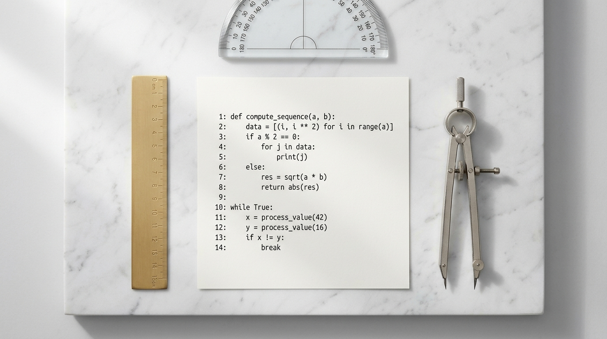
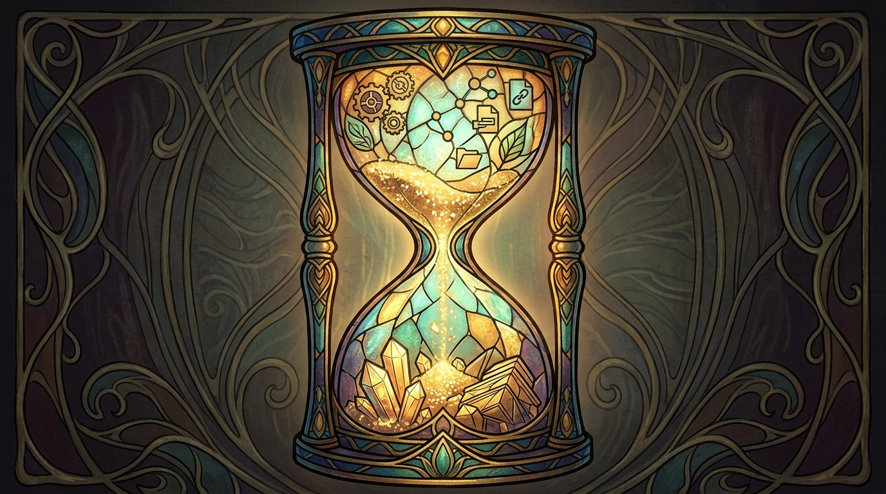
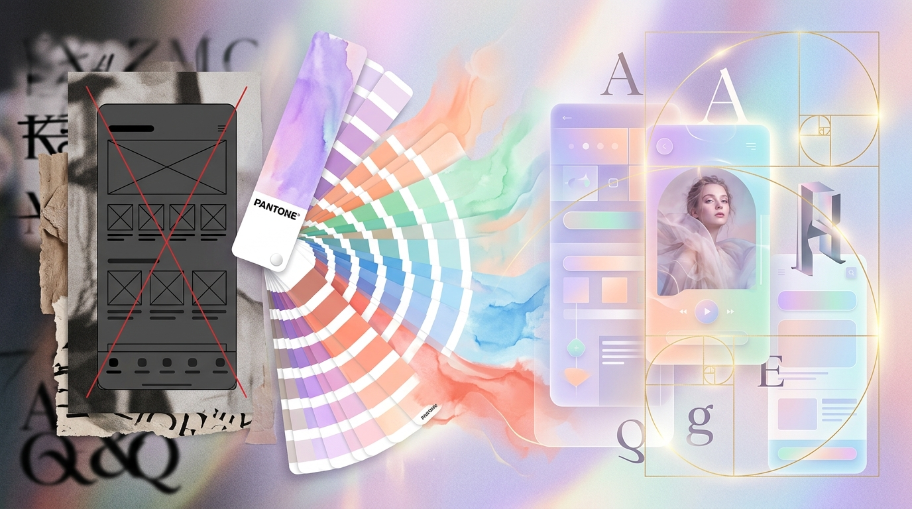
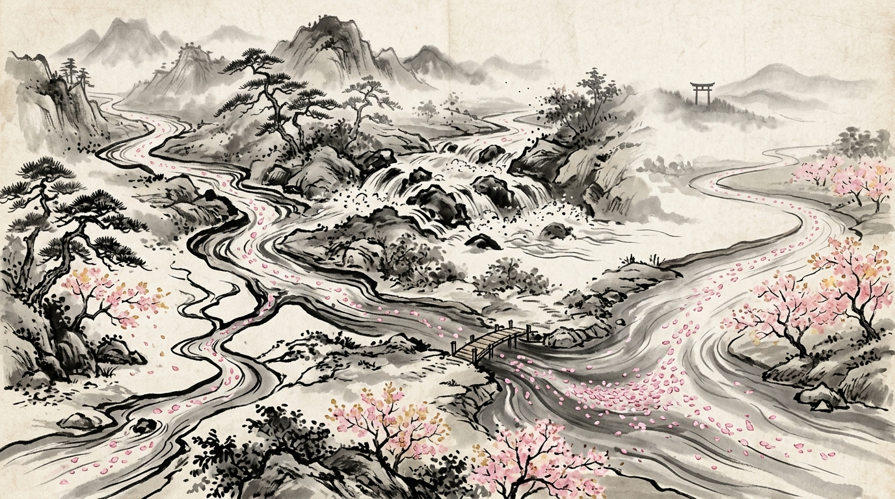

# Skills — Showcase

A visual index of the library. Each skill gets a hero image in a shared house style: a **retro-futuristic 1960s mission-control room** — banks of vintage CRT monitors, brass-and-wood consoles with operators, and a glowing holographic emblem unique to that skill. Decorative only — the functional index is [README.md](README.md) and the machine-readable one is [skills.json](skills.json).

> **Status:** 16 / 34 heroes generated. The remaining 18 are pending (agy image-quota); generation recipe in [assets/hero-prompts.md](assets/hero-prompts.md). Pending entries are marked 🎨.

---

### [Agy](skills/Agy)

Delegate a coding, refactor, PR-review, or image task to the Antigravity CLI (`agy`) as an autonomous worker.

### [Art](skills/Art)

Generate images, diagrams, and visual output for any visual artifact.

### [BackendDesign](skills/BackendDesign)

Reference for API design, database schema, and server architecture.

### [Build](skills/Build)

Implement plan tasks one at a time with compile and commit gates.

### [CodebaseOnboarding](skills/CodebaseOnboarding)

Analyze an unfamiliar repo → architecture map, entry points, conventions, starter CLAUDE.md.

### [CodingStandards](skills/CodingStandards)

Language coding standards — TS, Python, Bash, PowerShell, Swift, Rust.

### [ContextBudget](skills/ContextBudget)

Audit Claude Code context-window consumption and produce prioritized token-savings recommendations.

### [CreateCLI](skills/CreateCLI)

Generate a production-ready TypeScript CLI (manual argv / Commander / oclif), Bun-only, gated by Verify.

### [CreateMcp](skills/CreateMcp)

Build a Model Context Protocol (MCP) server with the official SDK — tools, resources, prompts, transport, security.

### [CreateSkill](skills/CreateSkill)

Build and maintain skills in canonical structure.

### [DataReportBuilder](skills/DataReportBuilder)

Turn a raw Excel/CSV dataset into a two-layer stakeholder report — plain-language summary + untouched raw data.

### [DockerPatterns](skills/DockerPatterns)

Reference for Docker and Docker Compose local-dev patterns.

### [FrontendAesthetics](skills/FrontendAesthetics)

Anti-slop visual direction — typography, color, hierarchy, motion — so UI looks intentional.

### [FrontendDesign](skills/FrontendDesign)

Reference for React and Next.js component design patterns.

### [GitHubOps](skills/GitHubOps)

Manage a GitHub repo via the `gh` CLI — hygiene, changelog, commit/push, PRs, releases.

### [GitWorkflow](skills/GitWorkflow)

Reference for git branching, commit conventions, merge vs rebase, and conflict resolution.

### [Hygiene](skills/Hygiene) 🎨
_hero pending_ — Audit `~/.claude` for git, skill, code, and rules hygiene issues.

### [Iterate](skills/Iterate) 🎨
_hero pending_ — Bounded PLAN→ACT→VERIFY→REFLECT iteration toward a goal, with a state file and hard exit conditions.

### [IterativeDepth](skills/IterativeDepth) 🎨
_hero pending_ — Run 2–8 multi-lens passes over a problem to surface hidden requirements.

### [OpenCode](skills/OpenCode) 🎨
_hero pending_ — Delegate a coding/refactor/PR-review task to the OpenCode CLI as an autonomous worker.

### [Orchestrate](skills/Orchestrate) 🎨
_hero pending_ — Decompose a spec into a dependency DAG, run units in parallel via delegation, review each separately.

### [Pi](skills/Pi) 🎨
_hero pending_ — Delegate a coding/refactor/PR-review task to the Pi (pi.dev) CLI as an autonomous worker.

### [Prompting](skills/Prompting) 🎨
_hero pending_ — Vendor-agnostic prompt-engineering standard library for authoring prompts, skills, agents, rules.

### [Reflect](skills/Reflect) 🎨
_hero pending_ — Self-rate the just-finished output on five axes with evidence, then fix small gaps in place.

### [Research](skills/Research) 🎨
_hero pending_ — Research a question at three depths by delegating to Agy/OpenCode/Pi + web search, then synthesize.

### [SecurityReview](skills/SecurityReview) 🎨
_hero pending_ — Audit code for vulnerabilities and secrets.

### [Simplify](skills/Simplify) 🎨
_hero pending_ — Post-implementation dead-code cleanup (`/simplify`).

### [SkillForge](skills/SkillForge) 🎨
_hero pending_ — Audit the whole skill library for agentic readiness and instrument it with telemetry in bulk.

### [Spec](skills/Spec) 🎨
_hero pending_ — Explore code + memory, then write acceptance criteria before planning.

### [StrategicCompact](skills/StrategicCompact) 🎨
_hero pending_ — Reference for context-compaction strategy and timing.

### [TddWorkflow](skills/TddWorkflow) 🎨
_hero pending_ — Test-first development workflow.

### [Test](skills/Test) 🎨
_hero pending_ — Run TDD for features and bug fixes.

### [Verify](skills/Verify) 🎨
_hero pending_ — Six-phase quality gate (build→type→lint→test→secret→diff) ending in a READY / NOT READY verdict.

### [Workflows](skills/Workflows) 🎨
_hero pending_ — Index of composed skill chains; routes a task to the right ordered chain of skills.
